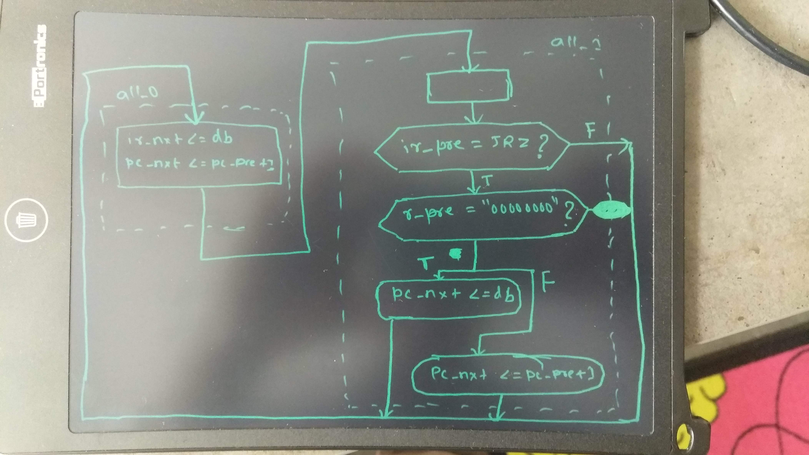

# Question [Canvas Link](https://usn.instructure.com/courses/20282/discussion_topics/131057)    [Pdf Link](W02_Jan_15_D1_Simple_CPU_JRZ_conditional_jump.pdf)

### 1) Present an ASMD chart for a JRZ \<address> instruction (Jump if R is zero). Assume that \<address> is an 8-bit value stored in memory immediately after the JRZ opcode.
ASMD chart only showing JRZ instruction


### 2) Add this instruction to your Vivado Basic CPU project and paste below the simulation waveforms that prove its correct operation.

Below code changes will be in [source cpu file](CPUwithROMfiles/cpu.vhd)

After this section in file i.e. [after line 21](CPUwithROMfiles/cpu.vhd#L21)
```vhdl
	constant LDRM: unsigned := "10100000"; -- A0H	
	constant INCR: unsigned := "10110000"; -- B0H
	constant JMPM: unsigned := "11000000"; -- C0H
```
Below line is added :white_check_mark: :white_check_mark: :white_check_mark: :white_check_mark: :white_check_mark:
```vhdl
	constant JRZ: unsigned := "11010000"; -- D0H
```


After this section in file i.e. [after line 70](CPUwithROMfiles/cpu.vhd#L70)

```vhdl
process(st_pre,db,pc_pre,r_pre)	-- next state + (Moore) outputs code section
begin
	st_nxt <= st_pre;
	pc_nxt <= pc_pre;	
	ir_nxt <= ir_pre;
	r_nxt <= r_pre;
	
	case st_pre is
		when all_0 => 					 
			ir_nxt <= unsigned(db);  
			pc_nxt <= pc_pre+1;
			st_nxt <= all_1;
		when all_1 =>			
			if (ir_pre = LDRM) then	  
			    r_nxt <= unsigned(db);
           		pc_nxt <= pc_pre+1;
				st_nxt <= all_0;
			elsif (ir_pre = INCR) then
                 r_nxt <= r_pre+1;            
                 st_nxt <= all_0;
			elsif (ir_pre = JMPM) then
			    pc_nxt <= unsigned(db);		    
                st_nxt <= all_0;
```
Below lines are added :white_check_mark: :white_check_mark: :white_check_mark: :white_check_mark: :white_check_mark:
```vhdl		
			elsif (ir_pre = JRZ ) then  -- this condition is added 
				if ( r_pre = "00000000" )
					pc_nxt <= unsigned(db);
				else
					pc_next <= pc_pre + 1; -- skip to next instruction
				end if; 
			st_nxt <= all_0;
```
Continuing section 
```vhdl
			elsif (ir_pre = HALT) then
				st_nxt <= all_1;
			else 
				st_nxt <= all_0;
			end if;
			
	end case; 
end process;
```
