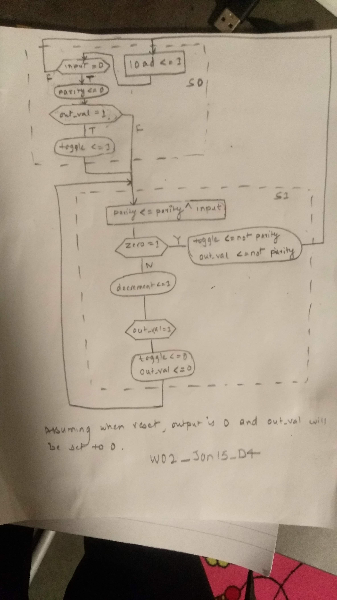

# Question [Canvas Link](https://usn.instructure.com/courses/20282/discussion_topics/129432) [Pdf Link](W02_Jan_15_D4_Odd_parity_generator_as_a_FSMD_From_a_datapath_to_an_ASMD_chart.pdf)

# Answer
Adding solution assuming, the counter counts 7 downto 0, and output is 0 when reset is 1.

