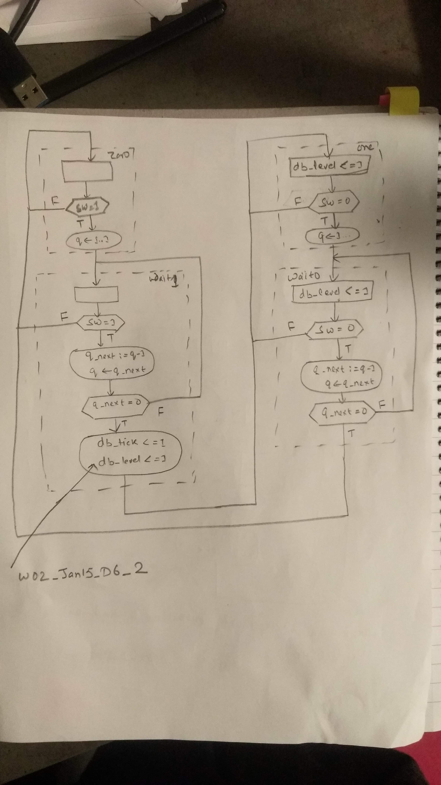

# Question [Canvas Link](https://usn.instructure.com/courses/20282/discussion_topics/129434) [Pdf Link](W02_Jan_15_D6_Debouncing_FSMD.pdf)

# Answer

### 1)What differences would a user notice in the circuit behaviour, if “q_next” was replaced by “q_reg” in the decision boxes of states wait1 and wait0?
The user will not notice difference. The q_reg in code listing is mapped to q in the asmd chart. As q_reg is updated after one clock cycle, the condition will be triggered one cycle later then the original expected time. Just 1 clock cycle delay, it may not be noticed by the user. 

### 2)Modify the ASMD chart in order to ensure that the “db_tick” output pulse rises together with the “db_level” output, instead of immediately before.

### 3)Modify the ASMD chart in order to generate a “db_tick” pulse also in the case of falling edges of the “db_level” output.

### 4)Why is it necessary to include the “q_next” signals in the sensitivity list of the “next-state & datapath functional units/routing” process in the implicit VHDL description? (listing 6.2, line 104 in the attached file)
"q_next" signal is used in if condition inside the process. The change in "q_next" value will trigger the process. 
