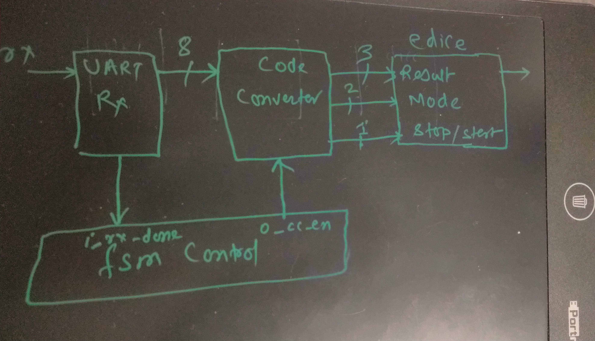

# Question [Canvas Link](https://usn.instructure.com/courses/20282/discussion_topics/129500) [Pdf Link](W03_Jan_29_D3_Cheating_e-dice_controlled_via_RS232.pdf)

# Answer
### 1) Represent a block diagram for the entire circuit. Is it an appropriate application for a small FSMD?
Fsmd diagram is below. The desired operation can be done in one state, so fsmd isn't appropriate.


### 2) Create a Vivado project to implement this architecture and check the correctness of your solution by simulation.

Just showing code convertor
```vhdl
library ieee;
use ieee.std_logic_1164.all;
use ieee.numeric_std.all;

entity code_convertor is
  port ( i_en:in std_logic;
         reset:in std_logic;
         i_value:in std_logic_vector ( 7 downto 0);
         o_result: out std_logic_vector ( 2 downto 0);
         o_mode: out std_logic_vector (1 downto 0);
         o_stop: out std_logic );

end code_convertor;


architecture arch_code_convertor of code_convertor is

	signal value:unsigned ( 7 downto 0);
begin

	value <= unsigned(i_value);
	process(reset,i_en)
	begin
		if ( reset = '1' ) then
			o_result <= "001"; -- let it be 1 , as 0 is invalid
			o_mode <= "000";
			o_stop <= '1'; -- 1 means stop, 0 means start
		elsif ( i_en = '1' )
			if (value >=1 and value <= 6)
				o_result <= i_value( 2 downto 0);
			elsif (value = 0)
				o_mode <= "00";
			elsif (value = 7)
				o_mode <= "01";
			elsif (value = 8)
				o_mode <= "10";
			elsif (value = 9)
				o_mode <= "11";
			elsif (i_value = x"53" or i_value = x"73" )
				o_stop = '1'
			elsif (i_value = x"20")
				o_stop <= '0';
			end if;
		end if;
	end process;

end arch_code_convertor;
```


### 3) Program the Basys-3 board and demonstrate the operation of your solution.
