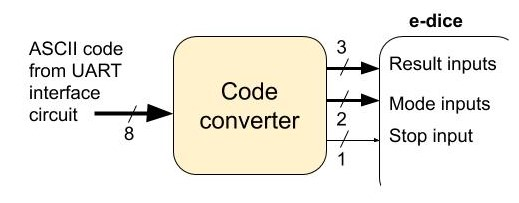

## W03-D3 Cheating e-dice controlled via RS232

#### Assume that we want to replace all switches and buttons in the cheating e-dice by control signals generated from ASCII codes received via RS232, according to the following specs:

- An ASCII code representing a digit `≥ 1` and `≤ 6` shall drive the equivalent binary pattern to the result inputs (e.g. ASCII code `X"35"` for digit `5` will generate `101` at the result inputs)

- The ASCII codes of the remaining digits (`0`, `7`, `8` and `9`) shall drive the following binary patterns to the mode inputs: `00` for ASCII `X"30"` (no-cheating), `01` for ASCII `X"37"` (forbidden result), `10` for ASCII `X"38"` (predefined result), and `11` for ASCII `X"39"` (triple probability)

- ASCII codes `X"53"` (`S`) and `X"73"` (`s`) should set the stop input to `1` (to stop the e-dice), and ASCII code `X"20"` (space bar) should set it to `0` (running mode)

- Any other ASCII codes must be ignored, and shall not change the previous values driven to the result, mode and stop inputs.

---

#### 1. Represent a block diagram for the entire circuit. Is it an appropriate application for a small FSMD?

#### 2. Create a Vivado project to implement this architecture and check the correctness of your solution by simulation.
