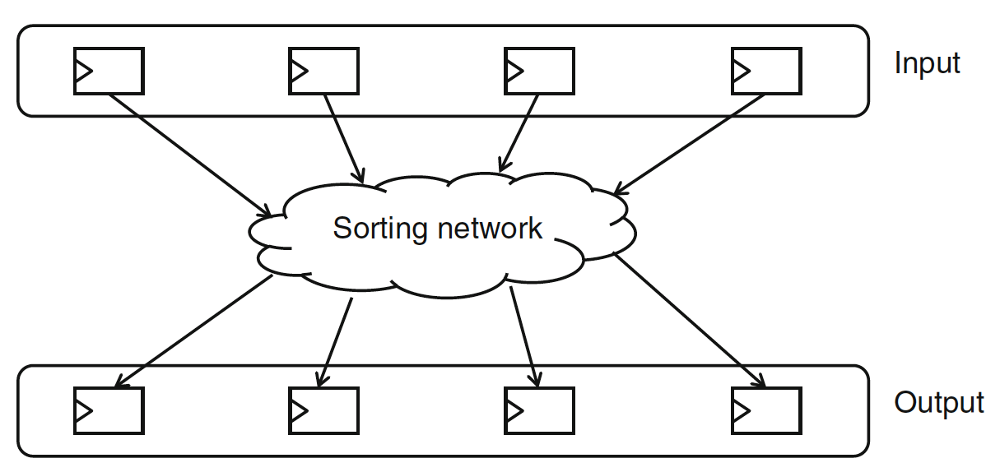

## W13-D1 Array sorter

*N.B.: This question is inspired in Patrick R. Schaumont, “A Practical Introduction to Hardware/Software Codesign“, Problem 5.2, pp. 151-152.*

### Consider a high-speed sorter for four 32-bit registers:

-----

#### 1. Present an FSMD architecture that implements this functionality.

------

#### 2. Can you compare the speed of your hardware architecture to an equivalent software solution?
