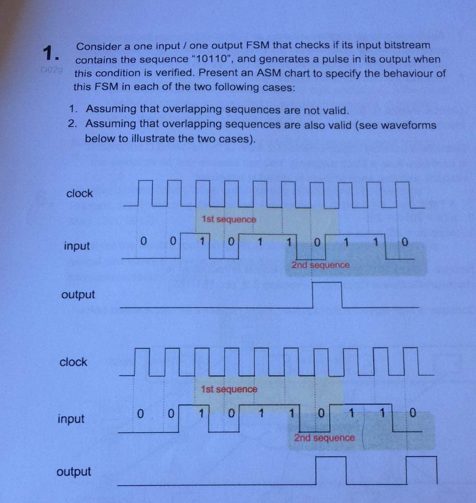
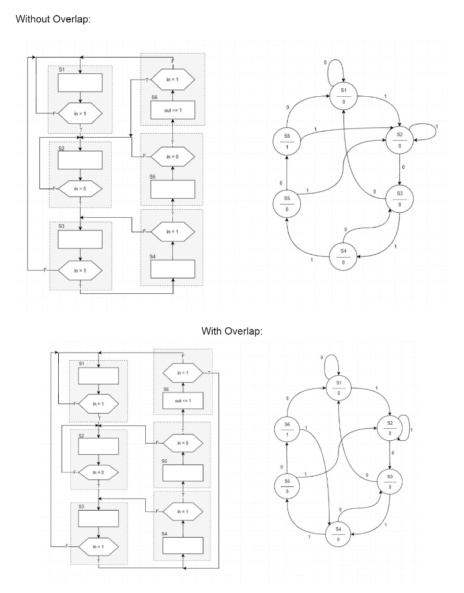
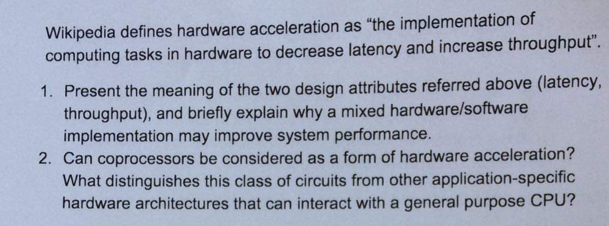
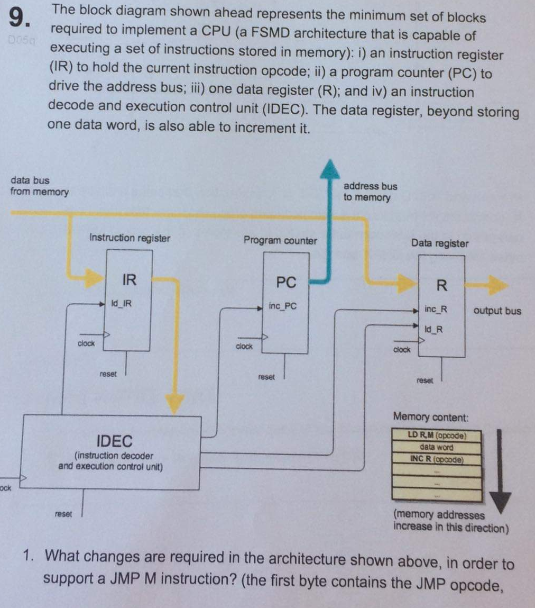
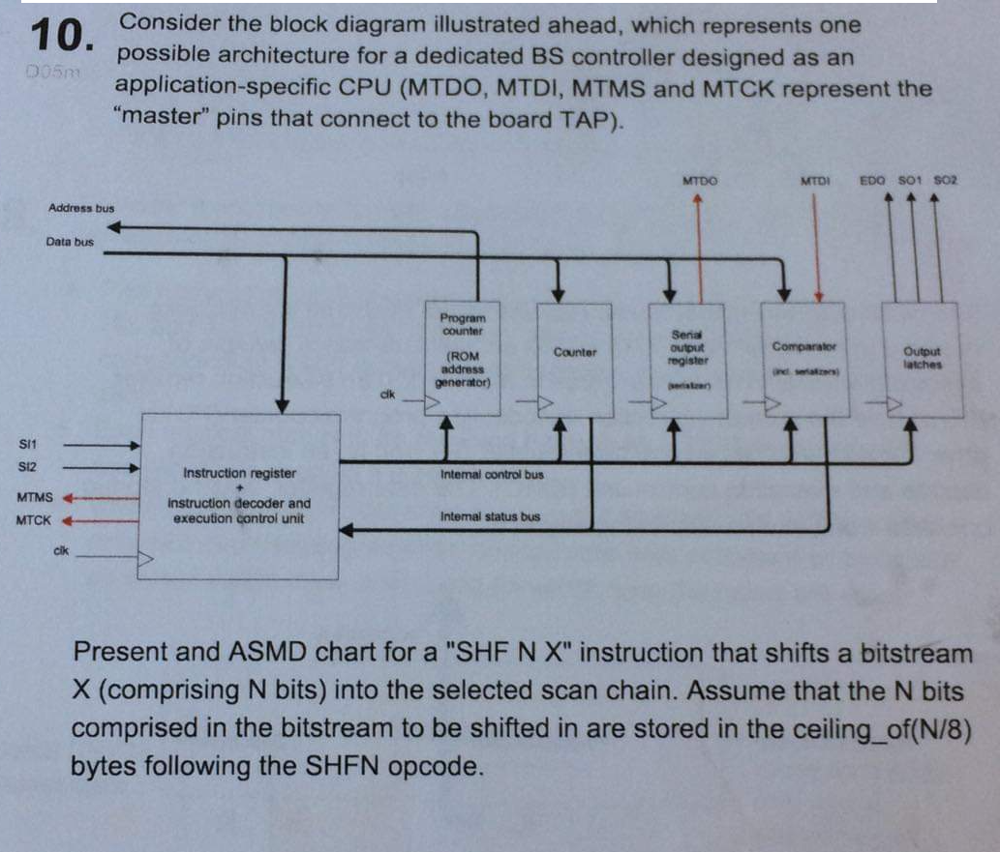

### SHC4300 Exam 2019

### 1.

>***Answer***

------
### 2. Same as Q1 and Q2 in [W2-D3](/Discussions/W02/W2-D3.md)  

------
### 3. Same as [W10-D2](/Discussions/W10/W10-D2.md)  

------
### 4. Same as [W13-D1](/Discussions/W13/W13-D1.md)  

------
### 5. Same as [W11-D2](/Discussions/W11/W11-D2.md)  

------
### 6. Same as [W12-D2](/Discussions/W12/W12-D2.md)  

------
### 7. HW acceleration

#### 1. Latency and throughput. Why a mixed HW/SW implementation may improve system performance.

* Latency is a time interval between the stimulation and response, it's the time delay between the cause and effect of some physical change in the system being observed.
* Throughput is a measure for how many units of information a system can process in a given amount of time.
* A mixed HW/SW implementation takes the parts of the code (SW) that takes the longest to execute and implements them in HW, and by doing so it decreases the total execution time (thereby reducing latency and increasing throughput).

#### 2. Co-processors as a form of HW acceleration. 

Co-processors can be considered as a form of HW acceleration because their basic functionality is to offload other processor-intensive tasks from the CPU in order to achieve accelerated system performance, by allowing the CPU to focus on the system's essential tasks.

------
### 8. Same as Q1 and Q2 in [W5-D2](/Discussions/W05/W5-D2.md)  

------
### 9.

------
### 10.

